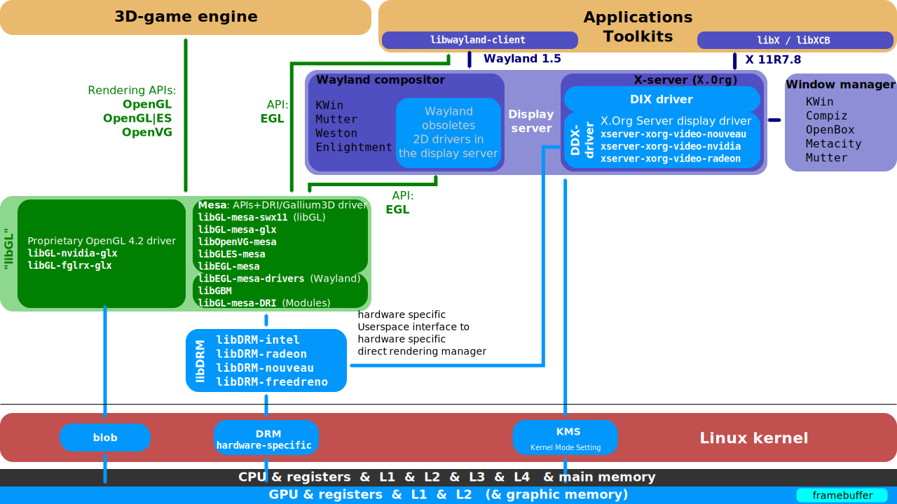
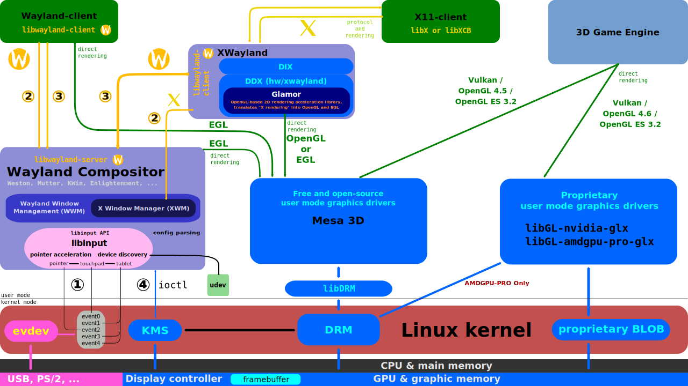
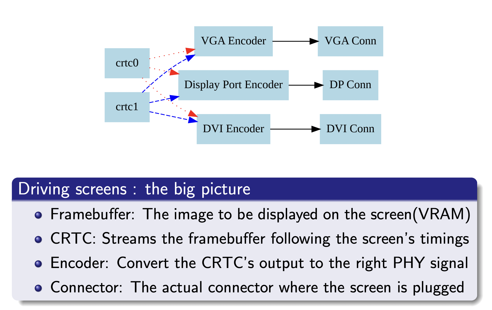

# linux渲染基础
###  Linux显示栈




___
### 显卡技术细节
[介绍](http://moi.vonos.net/linux/graphics-card-interfaces/)
#### 显卡驱动
Each driver has five parts:

+ A Linux kernel component DRM
+ A Linux kernel component KMS driver (the display controller driver)
+ A libDRM user-space component (a wrapper library for DRM system calls, which should only be used by Mesa 3D)
+ A Mesa 3D user-space component. This component is hardware-specific; it is executed on the CPU and translates OpenGL commands, for example, into machine code for the GPU. Because the device driver is split, marshalling is possible. Mesa 3D is the only free and open-source implementation of OpenGL, OpenGL ES, OpenVG, GLX, EGL and OpenCL. In July 2014, most of the components conformed to Gallium3D specifications. A fully functional State Tracker for Direct3D version 9 is written in C, and an unmaintained tracker for Direct3D versions 10 and 11 is written in C++.[37] Wine has Direct3D version 9. Another Wine component translates Direct3D calls into OpenGL calls, working with OpenGL.
+ Device Dependent X (DDX), another 2D graphics device driver for X.Org Server

#### 显存、内存访问与管理
##### GEM/TTM
The primary purpose of the Linux GEM/TTM libraries is to allow user-space code to manage memory buffers shared with the graphics card in order to transfer data such as vertexes and textures.

**GEM(The Graphics Execution Manager)**              
The GEM design approach has resulted in a memory manager that doesn’t provide full coverage of all (or even all common) use cases in its userspace or kernel API.   
GEM设计的方法并不能完全覆盖用户或者内核API的所有使用场景。  
GEM exposes a set of standard memory-related operations to userspace and a set of helper functions to drivers, and let drivers implement hardware-specific operations with their own private API.  
GEM是不关心数据Buffer的类型以及数据内容等。包含以下功能：
+ 内存申请与释放
+ 命令执行
+ 管理命令执行所消耗的时间

[一份比较老的GEM介绍文档](https://lwn.net/Articles/283798/)

##### Graphics Translation Table (GTT)
GTT作为内存管理模块存在于集成显卡中。用于将GPU指令中的内存地址映射到物理内存地址（系统内存，非显存）。典型的代码就是intel的集成显卡。
[The Global GTT](https://bwidawsk.net/blog/2014/6/the-global-gtt-part-1/)
GTT可管理的内存数量是受限的。GTTs (the intel ones at least) have far fewer table entries, meaning that there is a limit to the amount of memory that the CPU can make available to them. 因此，Intel开发了PPGTT用于解决这个问题。

##### DMA（直接内存访问）
When DMA is initiated from the CPU side, then the only on-graphics-card memory that can be addressed is that which has been mapped via a PCI BAR (the “aperture”). However when DMA is initiated by the graphics card, it can address all of system memory, and all of the card memory.
基于数据安全考虑，PCI controller中包含IOMMU模块，用于控制PCI设备（比如显卡）通过DMA技术可以访问的内存的范围。

##### 计算机内存带宽
可能已经过时了（2022年备注）
Table 30-1. Available Memory Bandwidth in Different Parts of the Computer System
Component | Bandwidth
--|--
GPU Memory Interface | 35 GB/sec
PCI Express Bus (x16) | 8 GB/sec
CPU Memory Interface (800 MHz Front-Side Bus) | 6.4 GB/sec

#### 显卡计算单元与指令集
Scalar (SISD) Instructions:
指令|功能
--|--
ADD, SUB, MUL, ABS, MIN, MAX | standard maths ops
AND, OR, XOR, SHL, SHR, NOT | standard bit ops
BFM, BFE | bitfield operations
CMP_EQ, CMP_GT, CMP_LT, CMP_GE, CMP_LE, BITCMP | set condition flag
CBRANCH | jump if condition flag set
CMOV | copy data if condition flag set
WQM | wholeQuadMode: if any bit in a group of 4 is set, set all bits
CountZeroBits, CountOneBits, FindLastBit |
ICACHE_INV | invalidate instruction cache


Vector (SIMD) Instructions:
指令|功能
--|--
ADD(t,s1,s2) | lane[i].reg[t] = lane[i].reg[s1] + lane[i].reg[s2] for all i (ie perform t=s1+s2 on all lanes) as above for SUB, MUL, MIN, MAX
SHR(t,s1,s2) | lane[i].reg[t] = lane[i].reg[s1] >> lane[i].reg[s2] for all i ( ie perform t=s1»s2 on all lanes)
AND/OR/XOR/BFM etc | vectorised too
LDEXP | result = arg1 ^ (2*arg2) – ie C library function ldexp() in hardware
CEIL | about a dozen types of float->int conversion operations
FLOOR | about a dozen types of int->float conversion operations
RCP, RSQ | reciprocal value, reciprocal square root
SQRT, SIN, COS | trigonometry
CUBEID | compute a “face id” from a cubemap (result is an integer 0..5)
CubeMapS, CubeMapT, CubeMapMajorAxis | 
LERP | unsigned 8bit pixel average (linear interpolation)
MED | compute median of 3 values
SAD | sum of absolute differences
INTERP | vertex parameter interpolation with barycentric coordinates
IMAGE_SAMPLE, IMAGE_GATHER | read from image buffer, and store “processed” values in registers rather than whole image 
 | copy lane[i] value to a scalar register
BUFFER_LOAD, BUFFER_STORE | transfer data between vector registers and main memory. Load/store ops explicitly control whether they want coherent data or not.
IMAGE_* | (for texture maps and typed surfaces) : can compute “fragid”, slice, z and face_id values
SAMPLE_* | can compute sample_b, sample_c, sample_d, gather values, or “derivatives” (ie slopes of geometric faces)
EXPORT | stores RGBA data into memory, and optionally Z (depth)

##### 计算单元的硬件
GPU的计算单元包含可变指令执行模块以及vector运算单元，每个运算单元有独立的L1以及内存。

___
### EGL
EGL provides mechanisms for creating rendering surfaces onto which client APIs can draw, creating graphics contexts for client APIs, and synchronizing draw-ing by client APIs as well as platform rendering APIs

EGL是对用户空间可见的一组显卡功能、资源的API接口。比如GEM内存对象会有对应的Handle，通过EGL可以实现在不同的进程间通过此Handle共享显存。在音视频的处理中，使用GPU处理后的视频数据在显存中，如果使用硬编则可以考虑直接将显存数据对应的Handle传递给GPU的编码模块，此时可能就需要使用EGL。
[EGL官网](https://registry.khronos.org/EGL/)
[EGL标准1.5](https://registry.khronos.org/EGL/specs/eglspec.1.5.pdf)

使用方式：通过glad库引入libEGL.so或者libEGL.dll中导出的函数或者符号。libEGL.so可以通过安装mesa 3D的SDK获得。

##### EGLDisplay
This represents the abstract display on which graphics are drawn. In most environments a display corresponds to a single physical screen.
All EGL objects are associated with an EGLDisplay, and exist in a names-pace defined by that display. Objects are always specified by the combination of an EGLDisplay parameter with a parameter representing the handle of the object.

___
### Mesa (Mesa 3D)
[介绍-Wikipedia](https://en.wikipedia.org/wiki/Mesa_(computer_graphics)
Mesa, also called Mesa3D and The Mesa 3D Graphics Library, is an open source implementation of OpenGL, Vulkan, and other graphics API specifications. Mesa translates these specifications to vendor-specific graphics hardware drivers.

Mesa implements a translation layer between a graphics API such as OpenGL and the graphics hardware drivers in the operating system kernel. 


这个开源的实现不太完整。NV好像不支持。

___

### DRM

+ 库：libdrm
+ 主体：CRTC、encoder、Connector、FrameBuffer

+ CRTC、encoder、Connector、FrameBuffer的连接关系：
    FrameBuffer-->CRTC-->encoder-->Connector

The DRM layer provides several services to graphics drivers, many of them driven by the application interfaces it provides through libdrm, the library that wraps most of the DRM ioctls. These include vblank event handling, memory management, output management, framebuffer management, command submission & fencing, suspend/resume support, and DMA services.
DRM层的定位是介于显卡驱动与用户层代码之间，提供libdrm库使得用户层可以使用驱动中提供的显卡功能：
+ vblank event handling
+ memory management
+ output management
+ framebuffer management
+ command submission & fencing
+ suspend/resume support
+ DMA services

#### Connector
+ 一个Connector下有个支持的Mode列表。为支持的显示器属性列表。

#### 通过DRM或者KMS截图
问题：通过打开Resources，然后依次打开Connector、Encodeer、CRTC、FrameBuffer，最终调试发现无法map dump buffer。无权限。
[测试的代码](https://github.com/zhuqingquan/code-test/blob/master/linuxDrm/printModes.c)。编译后已管理员身份运行。

关于权限的问题：
捕捉屏幕的demo（printModes）已经试过setCap附加cap_sys_admin权限（cap_sys_admin+ep），没有效果，还是无权限DUMP buffer。
后续可以尝试：
+ DRM事关显示，需要安全，因此DRM有提供ioctl SET_MASTER，执行过此syscall的程序就可以成为唯一的DRM-Master显示管理程序，执行ioctl DROP_MASTER也可以放弃DRM-Master身份，一般X server就是DRM-Master。其他的非DRM-Master用户态程序通过DRM-Auth，具体过程是：执行ioctl GET_MAGIC得到一个32bit魔数，然后传给DRM-Master -> DRM-Master用此32位魔术ioctl AUTH_MAGIC给DRM设备 -> DRM设备给发起Auth的非DRM-Master应用持有的与此魔数对应的fd授权。

其他可尝试、参考的方法：
1. OBS的代码。[linux: add zero-copy screen capture using KMS and EGL](https://github.com/obsproject/obs-studio/pull/1758)
2. ffmpeg的代码。[ffmpeg kmsgrab](https://ffmpeg.org/ffmpeg-devices.html#kmsgrab)

#### vblank
显示器显示图像数据的过程，一般从左上角，按从左至右、从上至下的方式扫描像素数据。一般每扫描一行，会切换到下一行的左侧，行与行之间的返回过程称为水平消隐；一帧图像扫描完成，要从图像的右下角返回到图像的左上角，开始新一帧图像的扫描，这一时间间隔，叫做垂直消隐，也称场消隐（vblank）。从右下角返回左上角的时间间隔内，可以通知驱动进行下一帧图像的送显，一般硬件进入vblank后（也就是扫描完一帧图像）会通过中断机制触发硬件的vblank事件，然后再由驱动提交软件的vblank事件。

在DRM的设备（struct drm_device）中，每个CRTC会有个对应的vblank对象。

#### DRM驱动结构体
```c
struct drm_driver {
    int (*load) (struct drm_device *, unsigned long flags);
    int (*open) (struct drm_device *, struct drm_file *);
    void (*postclose) (struct drm_device *, struct drm_file *);
    void (*lastclose) (struct drm_device *);
    void (*unload) (struct drm_device *);
    void (*release) (struct drm_device *);
    void (*master_set)(struct drm_device *dev, struct drm_file *file_priv, bool from_open);
    void (*master_drop)(struct drm_device *dev, struct drm_file *file_priv);
    void (*debugfs_init)(struct drm_minor *minor);
    struct drm_gem_object *(*gem_create_object)(struct drm_device *dev, size_t size);
    int (*prime_handle_to_fd)(struct drm_device *dev, struct drm_file *file_priv, uint32_t handle, uint32_t flags, int *prime_fd);
    int (*prime_fd_to_handle)(struct drm_device *dev, struct drm_file *file_priv, int prime_fd, uint32_t *handle);
    struct drm_gem_object * (*gem_prime_import)(struct drm_device *dev, struct dma_buf *dma_buf);
    struct drm_gem_object *(*gem_prime_import_sg_table)(struct drm_device *dev,struct dma_buf_attachment *attach, struct sg_table *sgt);
    int (*gem_prime_mmap)(struct drm_gem_object *obj, struct vm_area_struct *vma);
    int (*dumb_create)(struct drm_file *file_priv,struct drm_device *dev, struct drm_mode_create_dumb *args);
    int (*dumb_map_offset)(struct drm_file *file_priv,struct drm_device *dev, uint32_t handle, uint64_t *offset);
    int (*dumb_destroy)(struct drm_file *file_priv,struct drm_device *dev, uint32_t handle);
    int major;
    int minor;
    int patchlevel;
    char *name;
    char *desc;
    char *date;
    u32 driver_features;
    const struct drm_ioctl_desc *ioctls;
    int num_ioctls;
    const struct file_operations *fops;
}
```

#### 参考资料
[Linux GPU Driver Developer’s Guide](https://docs.kernel.org/gpu/index.html)
[Free and open-source graphics device driver -- wikipedia](https://en.wikipedia.org/wiki/Free_and_open-source_graphics_device_driver)
[Graphics Card Interfaces](http://moi.vonos.net/linux/graphics-card-interfaces/)
[intel Graphics Memory view](https://01.org/sites/default/files/documentation/intel-gfx-prm-osrc-lkf-vol06-memory_views.pdf)
